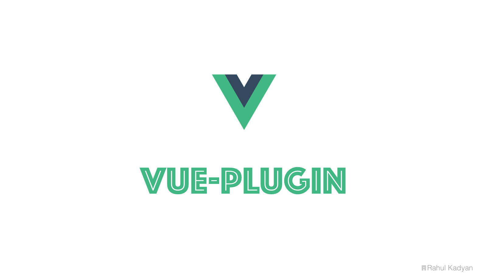

# Vue Plugin Skeleton
Template to create vue plugin or shareable components. The purpose of this Vue project templates is
to provide a simple setups so that users can get started with actual plugin code as fast as possible.



<p align="center">
  <a href="LICENSE">
    
  </a>
  <a href="https://github.com/znck/vue-plugin/releases">
    
  </a>

  <a href="https://github.com/znck/vue-plugin/issues">
    
  </a>
</p>

## Installation

[Node](https://nodejs.org/) and [vue-cli](https://github.com/vuejs/vue-cli) are required.

```sh
$ vue init znck/vue-plugin my-project
$ cd my-project
$ npm install
$ # or
$ yarn
```
The above command pulls this template, prompts for some information, and generates the project at `./my-project/`.

### What's Included

> TODO: Update docs.

## Change log

Please see [CHANGELOG](CHANGELOG.md) for more information what has changed recently.


## Contributing

Please see [CONTRIBUTING](CONTRIBUTING.md) and [CONDUCT](CONDUCT.md) for details.

## Security

If you discover any security related issues, please email :author_email instead of using the issue tracker.

## Credits

- [Rahul Kadyan][link-author]
- [All Contributors][link-contributors]

## License

The MIT License (MIT). Please see [License File](LICENSE.md) for more information.

[link-author]: https://github.com/znck
[link-contributors]: ../../contributors
